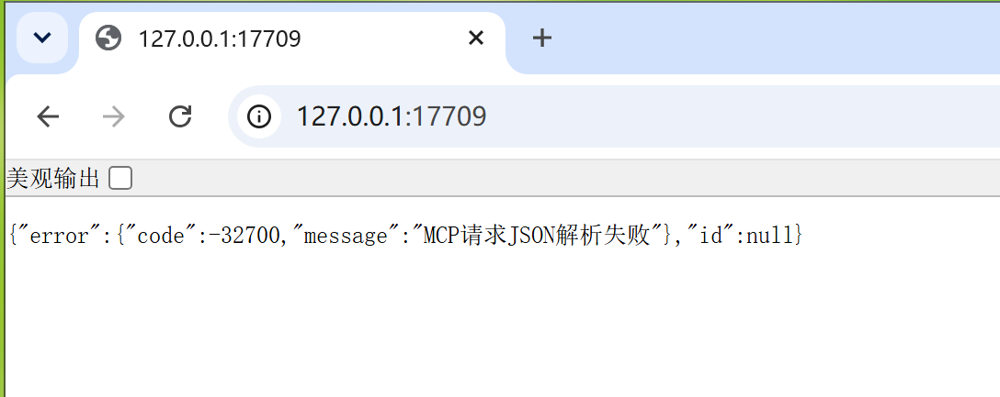
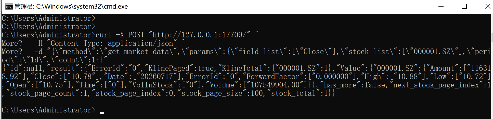
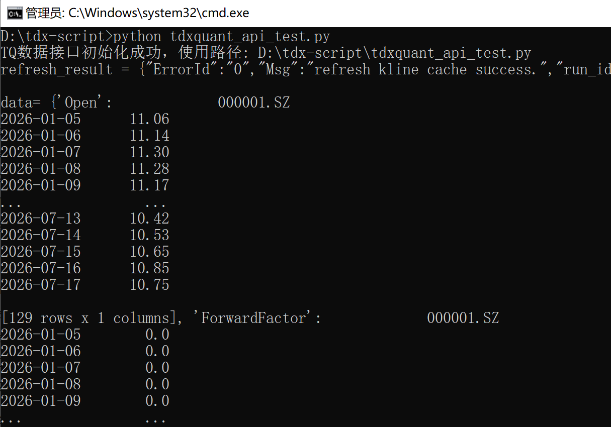

# TdxQuant 入门（二）：使用 curl 和 Python 获取第一份行情数据

[上一篇文章](/lab-technology/tdxquant/installation)完成了通达信金融终端、Python 环境和依赖库的安装。

这一篇不做复杂封装，只验证两件事：TdxQuant 的本地 HTTP 接口能否正常访问，以及 Python 能否成功获取历史行情数据。


## 视频演示

- [TdxQuant 入门（二）：通达信 Quant | 第一个 Python 行情程序](https://www.bilibili.com/video/BV1XeKr6QEF9/)


## 开始前的准备

运行下面的示例前，需要先启动通达信金融终端，并登录通达信账号。只获取行情时，不需要登录券商资金账号。

本文继续使用上一篇中的安装目录：

```text
C:\new_tdx64
```

## TdxQuant 的两种调用方式

TdxQuant 提供 Python API，同时在本机提供 HTTP 调用入口。

因此，Python 可以直接导入 `tqcenter` 调用；Java、Go、C# 等其他语言，也可以通过 HTTP 请求使用相关能力。

本文先通过 HTTP 接口确认服务正常，再使用 Python 调用 `tqcenter` 获取历史行情。

## 方式一：通过 HTTP 接口调用

### 使用浏览器确认服务已启动

通达信金融终端启动并登录后，TdxQuant 会在本机提供 HTTP 服务：

```text
http://127.0.0.1:17709/
```

可以先使用浏览器打开该地址。如果能够看到 TdxQuant 返回的页面或提示信息，说明本地 `17709` 端口已经启动。

不过，浏览器访问只能验证服务端口存在；是否能够正常调用行情接口，还需要继续使用 curl 发送 POST 请求。



截图中的“JSON 解析失败”是因为浏览器没有发送接口要求的 POST JSON。这里出现该提示，说明本地服务已经响应；接下来再用 curl 验证行情接口。

### 使用 curl 验证行情接口

官方文档在这里：[HTTP方式调用 | 通达信量化平台](https://help.tdx.com.cn/quant/docs/markdown/mindoc-1hdhbmi50d038.html)。

可以在命令提示符中执行下面的请求：

```shell
curl -X POST "http://127.0.0.1:17709/" ^
  -H "Content-Type: application/json" ^
  -d "{\"method\":\"get_market_data\",\"params\":{\"field_list\":[\"Close\"],\"stock_list\":[\"000001.SZ\"],\"period\":\"1d\",\"count\":1}}"
```

如果能够返回 JSON 数据，说明通达信客户端和 TdxQuant 本地 HTTP 服务已经正常运行。



从图中可以看到，接口返回了证券代码 `000001.SZ` 在 2026-07-17 的行情数据。
虽然请求中只指定了 `Close`，实际结果仍返回了 `Open`、`High`、`Low`、`Close` 等完整字段。其中，`Open` 表示开盘价，`Close` 表示收盘价。每个字段的含义请参考官方文档[获取K线行情getmarketdata](https://help.tdx.com.cn/quant/docs/markdown/mindoc-1ctuhthaq5qmg/mindoc-1h10g60jt68sc.html)。

::: tip 踩坑记录

实测发现，在通达信金融终端 V7.73 中，通过本地 HTTP 接口获取行情时，即使传入 `field_list=["Close"]`，接口仍然会返回完整的 K 线字段。上面的截图可以说明该问题。

这个问题不影响后续使用 Python API，因为 Python 调用时 `field_list` 可以正常生效。
:::


### 在 PowerShell 中调用

如果上一节的 curl 请求已经成功，并且不需要使用 PowerShell，可以跳过本节。

PowerShell 中的引号和转义规则与命令提示符不同。直接复制上一节的命令，可能会出现 JSON 格式错误。

建议先把请求体定义为变量，再发送请求：

```powershell
$body = @{
  method = "get_market_data"
  params = @{
    field_list = @("Close")
    stock_list = @("000001.SZ")
    period = "1d"
    count = 1
  }
} | ConvertTo-Json -Depth 5

$result = Invoke-RestMethod `
  -Uri "http://127.0.0.1:17709/" `
  -Method Post `
  -ContentType "application/json" `
  -Body $body

$result | ConvertTo-Json -Depth 10
```

这种写法比手动拼接 JSON 更容易阅读，也能减少引号转义带来的问题。

## 方式二：通过 Python API 调用

### 创建 Python 测试脚本

在任意目录创建一个 Python 文件，例如：

```text
tdxquant_api_test.py
```

由于 `tqcenter.py` 不属于通过 pip 安装的普通模块，需要先把通达信的模块目录加入 Python 搜索路径：

```python
import sys

TDX_USER_PATH = r"C:\new_tdx64\PYPlugins\user"
sys.path.insert(0, TDX_USER_PATH)

from tqcenter import tq
```

如果没有加入该目录，通常会出现：

```text
ModuleNotFoundError: No module named 'tqcenter'
```

### 初始化 TdxQuant

导入模块后，需要先调用 `initialize`：

```python
tq.initialize(__file__)
```

完整代码如下：

```python
import sys

TDX_USER_PATH = r"C:\new_tdx64\PYPlugins\user"
sys.path.insert(0, TDX_USER_PATH)

from tqcenter import tq

tq.initialize(__file__)
```

执行脚本前，要确认通达信金融终端已经启动并登录，否则初始化或后续数据调用可能失败。

### 刷新历史 K 线

第一次调用 `get_market_data` 时，可能只能获取最新一天的数据。这通常不是查询参数写错，而是通达信本地还没有完整的历史 K 线缓存。

可以先调用 `refresh_kline`，返回结果中的 `ErrorId` 为 `0` 时，表示本次刷新请求执行成功。

```python
refresh_result = tq.refresh_kline(
    stock_list=["000001.SZ"],
    period="1d",
)

print(refresh_result)
```

刷新操作会让客户端补充指定证券和周期的本地历史数据。刷新完成后，再调用行情查询接口。

### 获取历史行情

下面查询 `000001.SZ` 在指定日期范围内的日 K 数据：

> 下面的日期范围只是本文测试时使用的示例，读者可以根据需要自行修改。

```python
data = tq.get_market_data(
    field_list=[],
    stock_list=["000001.SZ"],
    start_time="20260101",
    end_time="20260718",
    dividend_type="front",
    period="1d",
)

print(data)
```

`field_list=[]` 表示获取接口默认返回的全部字段。`dividend_type="front"` 表示使用前复权行情。

### 完整示例

把刷新和查询放在一起，完整代码如下：

```python
import sys

TDX_USER_PATH = r"C:\new_tdx64\PYPlugins\user"
sys.path.insert(0, TDX_USER_PATH)

from tqcenter import tq

tq.initialize(__file__)

refresh_result = tq.refresh_kline(
    stock_list=["000001.SZ"],
    period="1d",
)
print("refresh_result =", refresh_result)

data = tq.get_market_data(
    field_list=[],
    stock_list=["000001.SZ"],
    start_time="20260101",
    end_time="20260718",
    dividend_type="front",
    period="1d",
)
print("data=", data)
```

保存文件后，在文件所在目录执行：

```shell
python tdxquant_api_test.py
```

本文实际测试中，刷新前只能获取到一条日 K；执行 `refresh_kline` 后，同一时间范围可以正常返回完整历史数据。

执行结果截图如下：



从截图中可以看到，`refresh_kline` 返回结果中的 `ErrorId=0`，说明历史 K 线刷新成功；随后 `get_market_data` 返回了指定日期范围内的日 K 数据。


## 理解 Python API 的返回结果

### 返回数据为什么是 DataFrame

通过 Python API 调用 `get_market_data` 时，返回的不是普通的 JSON 数组，而是按照字段组织的数据结构，其中每个字段对应一个 pandas `DataFrame`。

返回结构可以理解为：

```text
{
  "Open": DataFrame,
  "High": DataFrame,
  "Low": DataFrame,
  "Close": DataFrame,
  "Volume": DataFrame,
  "Amount": DataFrame
}
```


这种结构适合在 Python 中进行批量计算，但不能直接作为普通 JSON 返回。[下一篇文章](/lab-technology/tdxquant/build-http-service)封装内部行情服务时，会先把它转换成按日期排列的普通对象。

### 为什么字段以大写字母开头

TdxQuant 返回的行情字段使用通达信原始命名，例如：

```text
Open
High
Low
Close
Volume
Amount
```

在简单调用阶段可以保留原始字段。工程化封装时，再在 API 边界统一转换为 `open`、`high`、`low`、`close` 等命名，避免业务系统依赖底层数据源的字段风格。

### 关于 Volume 和 Amount 的单位

官方示例对 `Volume` 和 `Amount` 给出了单位说明，但不同证券类型的实际返回结果仍应进行验证。

在正式入库前，建议分别选取股票和 ETF，将 TdxQuant 返回值与通达信界面、交易所数据或现有 MiniQMT 数据进行对比，不要直接假设 `Volume` 必须乘以 100。

## 常见问题

### 无法导入 tqcenter

检查下面的文件是否存在：

```text
C:\new_tdx64\PYPlugins\user\tqcenter.py
```

同时确认代码中加入的是 `PYPlugins\user` 目录，而不是 `tqcenter.py` 文件本身。

### 提示缺少 numpy 或 pandas

执行：

```shell
python -m pip install numpy pandas -i https://pypi.tuna.tsinghua.edu.cn/simple
```

### 只能获取一条 K 线

先执行 `refresh_kline`，等待刷新完成后再调用 `get_market_data`。

如果仍然只有一条数据，检查证券代码、周期、日期范围以及通达信客户端是否保持在线。

### HTTP 接口无法连接

确认通达信金融终端已经启动并登录，并检查请求地址是否为：

```text
http://127.0.0.1:17709/
```

`127.0.0.1` 只允许本机访问。不要直接把这个端口暴露到公网。

## 本篇小结

到这里，我们已经通过两条路径验证了 TdxQuant：

```text
curl / PowerShell
→ 验证本地 HTTP 服务

Python + tqcenter
→ 刷新并获取历史行情
```

这说明 TdxQuant 不仅可以在 Python 中直接使用，也可以作为其他语言接入通达信行情能力的基础。

## 下一步

[下一篇文章](/lab-technology/tdxquant/build-http-service)将讨论如何把 TdxQuant 封装为内部行情服务，统一返回结构，并加入初始化管理、调用锁、访问鉴权和异常处理。

最终形成下面的调用链路：

```text
Spring Boot 等任务需要行情数据的服务
→ 内部行情 API
→ TdxQuant
→ 通达信金融终端
```
