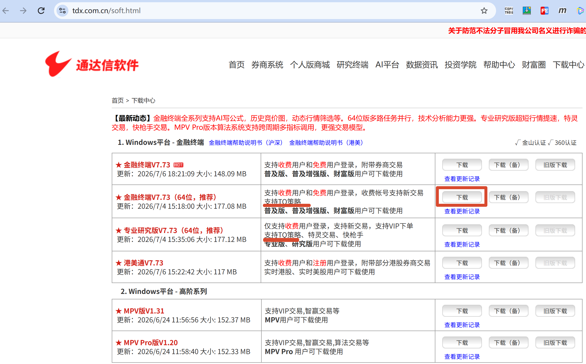
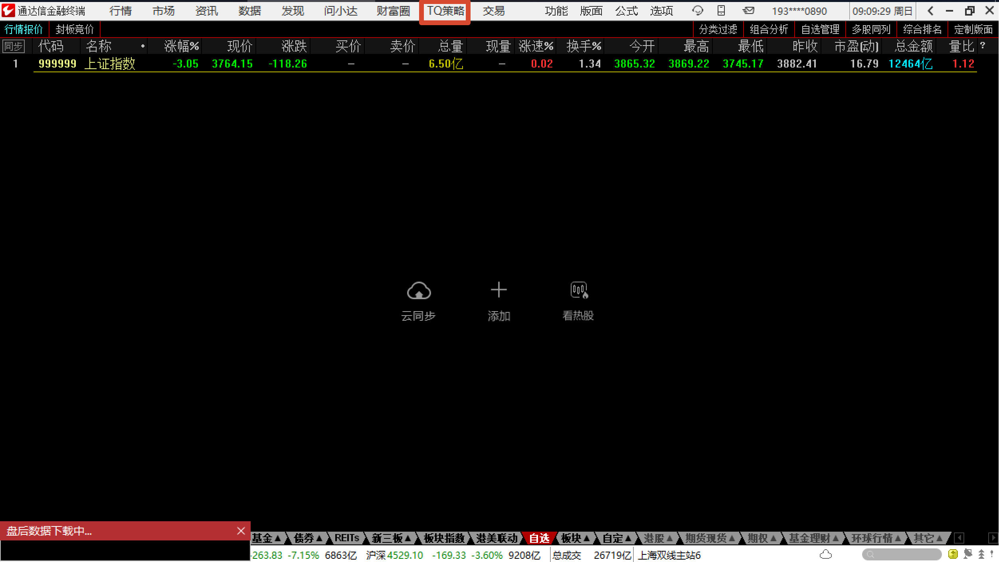
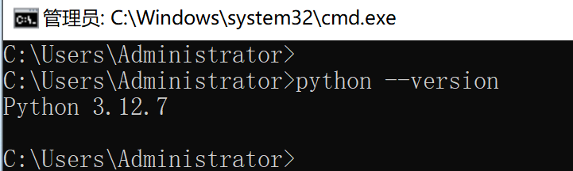

# TdxQuant 入门（一）：安装通达信金融终端与 Python 环境

## 这篇文章适合谁

这篇文章适合希望通过 Python 获取股票、ETF、指数等行情数据，并计划将行情接入自己程序或数据平台的开发者。

如果你正在使用 MiniQMT，想寻找一个备用行情源，或者希望在 Windows 虚拟机、云服务器中长期运行行情采集服务，也可以参考本文。

本篇只需要会安装 Windows 软件，并能在 PowerShell 或命令提示符中执行命令。即使暂时不了解 curl、HTTP，也不影响完成本文的安装步骤，后续用到时再逐步了解即可。

## 准备通达信金融终端

### TdxQuant 是什么

TdxQuant 是通达信提供的 Python 量化接口，可以通过代码调用通达信客户端中的行情、公式、财务数据、模拟交易和实盘交易等功能。

在本文中，可以先把“TQ 策略”理解为通达信客户端中使用 TdxQuant 相关能力的入口。后面检查客户端是否存在 TQ 策略入口，是为了确认当前安装的终端具备运行 TdxQuant 的基础条件。

本文只关注最基础的环境安装。行情调用、历史数据刷新和 HTTP 接口验证会放在[下一篇文章](/lab-technology/tdxquant/basic-usage)中。

### 选择通达信版本

官方下载地址：[通达信软件下载中心](https://www.tdx.com.cn/soft.html)

通达信目前提供`金融终端 64位`、`专业研究版`和`金融终端（量化模拟）`等多个版本，它们都支持 TQ 策略。

如果只是获取行情并学习 TdxQuant，推荐使用免费的金融终端 64 位版。专业研究版主要面向付费用户，量化模拟版则不提供券商实盘交易。

本文使用并验证的是 `金融终端 64 位`，后续示例也将以该版本为准。

另外，本文也实际测试过 `金融终端（量化模拟）`，同样可以使用 TdxQuant。


下载页面及入口如下：




### 安装通达信金融终端

进入通达信官方下载中心，下载金融终端 64 位版，并按照安装程序提示完成安装。

建议安装到路径较短、容易识别的目录，例如：

```text
C:\new_tdx64
```


> 注意：[下一篇](/lab-technology/tdxquant/basic-usage)会用到该路径。


### 注册并登录通达信账号

首次启动金融终端时，需要使用手机号注册或登录通达信账号。

只获取行情时，不需要登录券商资金账号。登录通达信账号并保持客户端在线，即可使用 TdxQuant 行情接口。

### 确认终端支持 TQ 策略

登录金融终端后，可以在客户端菜单中查找“TQ 策略”“TQ 策略管理器”或类似入口。



> 本文使用的通达信金融终端 V7.73 已经实际验证支持 TQ 策略。


也可以检查安装目录中是否存在以下文件：

```text
PYPlugins\user\tqcenter.py
TPythClient.dll
```

## 准备 Python 运行环境

### 安装 Python 环境

官方文档：[Python 环境与依赖库安装](https://help.tdx.com.cn/quant/docs/markdown/mindoc-1cfsjkbf8f3is/mindoc-1d00970eq1rtc.html)

官方文档建议使用 Python 3.7 及以上版本。本文使用的是 Python 3.12.X 64 位版，建议 Python 与通达信客户端保持相同的 64 位架构。

安装时建议勾选 `Add Python to PATH`。安装完成后，可以在命令行中执行以下命令确认：

```shell
python --version
```



### 安装依赖库

具体说明可参考官方文档中的[安装 IDE 与依赖库](https://help.tdx.com.cn/quant/docs/markdown/mindoc-1cfsjkbf8f3is/mindoc-1d00970eq1rtc.html#_2-%E5%AE%89%E8%A3%85ide-%E5%BB%BA%E8%AE%AEvscode%E3%80%81pycharm%E6%88%96trae)。

`tqcenter.py` 依赖 `numpy` 和 `pandas`，需要提前安装这两个 Python 包。

在 PowerShell 或命令提示符中执行：

当前只需要安装 `numpy` 和 `pandas`：

```shell
python -m pip install numpy pandas -i https://pypi.tuna.tsinghua.edu.cn/simple
```

回测、技术指标和数据可视化还可能用到其他依赖库，但本篇暂时不需要。等后续功能实际用到时再安装，可以减少当前的环境配置和排错成本。


### 找到 TdxQuant Python 模块

TdxQuant 的 Python 模块通常位于通达信安装目录下：

```text
C:\new_tdx64\PYPlugins\user\tqcenter.py
```

它不是普通的 PyPI 包，因此不需要执行 `pip install tqcenter`。运行自己的 Python 脚本时，需要让 Python 能够找到 `PYPlugins\user` 目录。

本篇暂时不需要修改系统环境变量。下一篇运行示例代码时，我们会在 Python 代码中加入该目录，并说明具体写法。

### 了解 TQ 相关目录结构

一个常见的通达信目录结构如下：

```text
C:\new_tdx64
├─ TPythClient.dll
└─ PYPlugins
   └─ user
      └─ tqcenter.py
```

`tqcenter.py` 会调用通达信目录中的 `TPythClient.dll`，因此不要单独复制 `tqcenter.py` 到其他目录使用。

## 长期运行与完成检查

### 在虚拟机中运行 TdxQuant

> 小刘已经实际验证，截至2026-07-19，通达信金融终端 V7.73 可以在 Windows 虚拟机中正常运行。

通达信金融终端和 TdxQuant 可以运行在 Windows 虚拟机中。虚拟机需要能够正常联网、显示桌面并保持用户登录状态。

用于长期采集行情时，建议关闭 Windows 自动休眠，并避免注销当前用户。远程桌面使用完成后可以断开连接，但不要退出 Windows 会话。

### 安装完成后的检查清单

完成安装后，可以确认以下项目：

```text
通达信金融终端可以正常登录
客户端中存在 TQ 策略入口
PYPlugins\user\tqcenter.py 存在
TPythClient.dll 存在
Python 可以正常运行
numpy 和 pandas 已安装
```

这些检查全部通过后，说明 TdxQuant 的基础运行环境已经准备完成。

## 下一步

[下一篇文章](/lab-technology/tdxquant/basic-usage)将分别使用通达信提供的本地 HTTP 接口和 Python API，验证 TdxQuant 是否能够正常获取行情数据。
